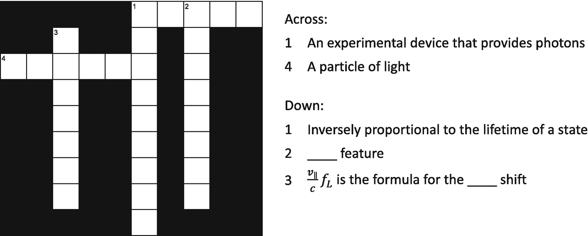

## Abstract

In this chapter, we explore the clever spectroscopy technique known as saturated absorption spectroscopy. This technique is used to remove Doppler profiles from spectroscopic signals. We will learn how saturated absorption spectroscopy works, including the roles of probe and pump beams, and the resulting spectral features. Additionally, we will examine the artifacts, specifically crossover features (*V*, $\Lambda$, and *X* crossovers), that may appear due to this technique and understand the conditions under which they occur. Practical examples using various atoms, advanced techniques for achieving crossover-free spectroscopy, and potential issues are also discussed.

## Learning Goals

By the end of this chapter, you should be able to understand:

- saturated absorption spectroscopy: How we use two counterpropagating lasers to produce a spectrum that looks like the atoms are at 0 Kelvin.
- crossover features: Artifacts of saturated absorption spectroscopy.
- the conditions under which different types of crossover features (*V*, $\Lambda$, *X*) appear and how to identify them in a spectrum.

(sec-5-1)=
## 5.1 Saturated Absorption Spectroscopy

**Saturated absorption spectroscopy** is a really neat spectroscopy trick used on a vapor cell with hot atoms that creates a transmission plot with only spectral features from the atoms that are moving perpendicular to the laser ($v_{\parallel }=0$). Reread that sentence! It is really quite amazing. Suppose the atoms are at 400 K. We know that if we use a single laser beam, we would expect to see a Doppler broadened spectrum from these atoms that is Gaussian in shape. Saturated absorption spectroscopy uses two laser beams, resulting in a small Lorentzian feature on top of the Gaussian shape, as shown in Fig. [](#fig-5-1). The small Lorentzian feature comes only from those atoms that have zero speed in the direction of the laser.[^1]

```{figure} ../images/ch-05/541577_1_En_5_Fig1_HTML.png
:name: fig-5-1

An illustrative example showing the transmission plots for a two-level atom. On the left is the Doppler profile we learned about in Chap. [](#ch-4). On the right is the transmission plot for a saturated absorption setup
```

This is how we do it: we send two laser beams into a vapor cell from opposite directions, see Fig. [](#fig-5-2). The laser beam that starts on the left and moves to the right has a small amount of power. We call this laser the **probe beam**. In saturated absorption spectroscopy, we measure the transmission of the probe beam. The other laser starts on the right and is moving to the left and has a large amount of power. We will call this laser the **pump beam**. In most experimental setups, the probe beam and the pump beam originate from the same laser. The laser can be split into two paths using, for example, a $\lambda$/2 plate and a polarizing beam splitter, see Sect. [](#sec-1-5). One would adjust the orientation of the $\lambda$/2 plate so that the probe beam has less power than the pump beam.

```{figure} ../images/ch-05/541577_1_En_5_Fig2_HTML.png
:name: fig-5-2

Saturated absorption spectroscopy needs two laser beams: a probe beam and a pump beam. Not pictured is the photodiode with which we monitor the transmission of the probe beam
```

To explore how this technique works, we will use our simple two-level atom. If the pump beam were not present, we know the transmission of the probe beam looks like Fig. [](#fig-5-3). This plot is calculated using the mass of a europium-156 atom and a vapor cell at 400 Kelvin. The natural linewidth of the transition is about 25 MHz, which is much smaller than the Doppler width of 320 MHz.

```{figure} ../images/ch-05/541577_1_En_5_Fig3_HTML.png
:name: fig-5-3

An example of a Doppler profile simulated using parameters for a transition in europium-156 atoms with a temperature of 400 Kelvin
```

Now, let’s add in the pump beam. Our ultimate goal is to determine how the transmission plot of the probe beam changes with the addition of the pump beam. Let’s start by thinking about the transmission of a laser through the vapor cell when the laser frequency is at $f_{A}$, see Fig. [](#fig-5-1). Since both the pump and the probe beam come from the same laser, they have the same frequency. The only difference is that they are moving in opposite directions. We want to ask the question: Which atoms interact with each laser beam?

As a reminder, the **Doppler shift** for an atom moving with velocity component $v_{\parallel }$ is given by the formula:

```{math}
:label: eq-5-1
\Delta f_{D}=-\frac{v_{\parallel}}{\lambda}=-\frac{v_{\parallel}}{c} f_{L}\rightarrow |v_{\parallel}|=\Delta f_{D} \frac{c}{f_{L}}
```

where $v_{\parallel }$ is negative if the atom is moving towards the laser source and positive if it is moving away.

I find it useful to use numbers, so let’s say that the frequency of the laser is set to $f_A$, and $f_A$ is 200 MHz below $f_r=652.0000\,\text{THz}$. Since we have two laser beams moving in different directions, we are going to use the magnitude of $v_{\parallel }$ and the descriptors “to the left” and “to the right” for the following discussion.

Let’s start with the probe beam, which is moving to the right. Since the frequency of the laser is below resonance, we know that atoms which interact with the probe beam have to be moving to the left with a specific $v_{\parallel }$ so that, according to those atoms, the Doppler effect shifts the laser frequency into resonance. That means the atoms would have to be moving at:

```{math}
:label: eq-5-2
v_{\parallel}=(200\times 10^6\,\text{Hz}) \frac{3\times 10^8\,\text{m/s}}{652\times 10^{12}\,\text{Hz}}=92\;\frac{\text{m}}{\text{s}}\text{ to the left}
```

to absorb light from the probe beam.

Now let’s think about the pump beam, which is moving to the left. That means the atoms that absorb light from the pump beam must be moving to the right. The math is the same, but the direction of movement is opposite:

```{math}
:label: eq-5-3
v_{\parallel}=(200\times 10^6\,\text{Hz}) \frac{3\times 10^8\,\text{m/s}}{652\times 10^{12}\,\text{Hz}}=92\;\frac{\text{m}}{\text{s}}\text{ to the right.}
```

Spend a few minutes on the above argument to make sure it all makes sense.

Here is the important take home message: When the frequency of the laser is at $f_A$, ***different*** atoms interact with the probe beam and the pump beam. Both lasers are losing photons, but they are losing photons to ***different*** atoms. Since we are monitoring the probe beam transmission, the probe beam transmission is the same whether the pump beam is on or off. Again, this is a very important concept so make sure it makes sense before moving on.

Your turn! The laser frequency is now at frequency $f_B$, which we will assume is 200 MHz higher than $f_r=652.0000\,\text{THz}$. What velocity does an atom need to have to absorb light from the probe beam? From the pump beam? The answers are in the footnotes.[^2]

The conclusion for when $f_L=f_B$ is the same as when $f_L=f_A$: When the frequency of the laser is at $f_B$, the probe beam transmission is the same whether the pump beam is on or off. The trick happens when the laser frequency is at $f_r$. The Doppler shift is 0, so both the probe and the pump beams interact with the ***same*** atoms. When the laser frequency is at $f_A$ or $f_B$ (or any frequency except $f_r$), the pump and the probe lasers interact with ***different*** atoms. When the laser frequency is at $f_r$, the two laser beams compete for the ***same*** atoms.

To explore this more, let’s do a thought experiment. First, we either block or turn off the pump beam so that there is only a probe beam. The probe beam frequency is set to the resonance frequency, and we’ll assume it hits a single atom at rest. Let’s say the probe beam has 10 photons that pass by the atom for every lifetime of the excited state. From those 10 photons, the atom absorbs 1 photon reducing the probe beam transmission to 9 photons; this is a 10% reduction in probe beam transmission. Now we turn the pump beam back on. The pump beam has more power than the probe beam. Let’s say the pump beam provides an additional 990 photons. The atom will randomly pick 1 photon from a possible 1000 photons (10 from the probe and 990 from the pump). Most likely the atom is going pick a photon from the pump beam. Since all 10 photons make it through, the transmission of the probe beam is larger when the pump beam is on. Every once in a while, the atom will randomly absorb from the probe beam, decreasing its transmission percentage. However, the transmission of the probe beam is, on average, larger when the pump beam is present. If we increase the number of atoms in the vapor cell, each atom with $v_{\parallel }=0$ will randomly absorb from either the pump beam or the probe beam. The conclusion is: *When the laser frequency matches the resonance frequency, the transmission of the probe beam is larger when the pump beam is present.*

What is really important is that this only happens for the atoms that have $v_{\parallel }=0$. For any other velocity, the probe beam transmission is exactly the same whether the pump beam is on or off. Let’s recap all of this in a table. To make things easier, we are going to define “moving to the left” (towards the probe beam) as negative and “moving to the right” as positive.

(tbl-5-1)=
**Table 5.1** Atoms that absorb from the probe beam and pump beam for each laser frequency

| $f_{L}$ | Velocity of atoms needed to absorb from probe beam. | Velocity of atoms needed to absorb from pump beam. | How does the pump beam change the transmission of the probe? |
| --- | --- | --- | --- |
| $f_A$ | $-$92 m/s | $+$92 m/s | It doesn’t |
| $f_r$ | 0 m/s | 0 m/s | Transmission increases |
| $f_B$ | +92 m/s | $-$92 m/s | It doesn’t |

**Summary**

If the laser frequency is not on resonance, the probe beam and pump beam are interacting with different atoms. In other words, the probe beam is losing photons to different atoms than the pump beam. On resonance, the two lasers compete for the same atoms, which results in less photons being absorbed from the probe beam.

A simulation of the transmission of the probe beam with the pump beam off (left plot) and with the pump beam on (middle) is shown in Fig. [](#fig-5-4).

```{figure} ../images/ch-05/541577_1_En_5_Fig4_HTML.png
:name: fig-5-4

The transmission plots of the probe beam for a 2 level atom with just a probe beam (left), the probe beam and a pump beam (middle), and the difference between the two transmission plots (right)
```

If we subtract the two plots (right), we are left with a spectral feature with a full width half maximum equal to the natural linewidth of the transition.[^3] This is the same plot as the absorption plot from the thought experiment that we did in Sect. [](#sec-3-1), which was an absorption plot for atoms at 0 Kelvin. We call this plot a **saturated absorption plot**. Neat trick, huh!

(sec-5-2)=
## 5.2 Crossovers

Saturated absorption spectroscopy is super cool.[^4] It allows us to use hot gas and still produce spectral features as if all of the atoms were frozen in place (absolute zero or 0 K). However, there is a trade off if there are multiple ground or excited states, and that trade-off is additional fake spectral features in our spectrum called crossovers. There are three types of crossovers: *V* crossovers, $\Lambda$ crossovers (the Greek letter capital lambda, so we call them “Lambda crossovers”), and *X* crossovers. The reason for the names should be clear as you examine the energy level diagrams for each in Fig. [](#fig-5-5). I want to point out that the labels, $F=4$, $F=5$, etc. have meaning that we explore in Chaps. [](#ch-7) and [](#ch-8). Even though we haven’t connected those labels to physics yet, I wanted to remind you about “The Rule” from Eq. [](#eq-3-15):

```{math}
:label: eq-5-4
\begin{array}{l} \text{The Rule} \\ \Delta F = -1, 0, +1 \\ F = 0 \nrightarrow F = 0 \end{array}
```

```{figure} ../images/ch-05/541577_1_En_5_Fig5_HTML.png
:name: fig-5-5

The three types of crossovers. A *V* crossover is due to the probe beam and pump beam exciting atoms from the same ground state to two different excited states. For a *V* crossover, the pump beam “steals” atoms from the probe beam. A $\Lambda$ crossover is due to the probe beam and pump beam exciting atoms from the two different ground states to the same excited state. A *X* crossover is due to the probe beam and pump beam exciting atoms from two different ground states to two different excited states. For both $\Lambda$ and *X* crossovers, the pump beam “gives” atoms to the probe beam
```

### 5.2.1 *V* Crossovers

Suppose you have an atom with one ground state that can be excited to two different excited states, as shown in Fig. [](#fig-5-6). The two excited states have resonance frequencies $f_{r1}$ and $f_{r2}$. Using the arguments explored in Sect. [](#sec-5-1), you might expect transmission plots shown in Fig. [](#fig-5-7). In the “Pump off” plot, I also plotted the individual Doppler profiles for both transitions (red and blue dashes). If you add these two together you will get the black curve. With the pump beam on, you might (correctly) expect to get Lorentzian features at laser frequencies $f_{r1}$ and $f_{r2}$.

```{figure} ../images/ch-05/541577_1_En_5_Fig6_HTML.png
:name: fig-5-6

The experimental setup and energy levels to think about V crossovers
```

```{figure} ../images/ch-05/541577_1_En_5_Fig7_HTML.png
:name: fig-5-7

A very reasonable, but incorrect guess for a saturated absorption spectrum for an atom with one ground state and two excited states
```

That prediction is close, but not quite correct. If you do the experiment, you will find that you have an additional Lorentzian shaped spectral feature exactly halfway between $f_{r1}$ and $f_{r2}$. This extra feature is called a *V* crossover. Let’s explore why this happens with an example. I always find it easier to use numbers, so let’s say that $f_{r2}$-$f_{r1}=600\,\text{MHz}$. The feature occurs when the laser frequency is set to 300 MHz above $f_{r1}$ and 300 MHz below $f_{r2}$. We are also going to define an atom moving right as positive velocity and an atom moving left as negative velocity.

Your turn: Having the laser frequency precisely between $f_{r1}$ and $f_{r2}$, calculate the velocity that an atom would need in order to absorb from the pump beam to excited state #1, from the probe beam to excited state #1, from the pump beam to excited state #2, and from the probe beam to excited state #2. Use $\lambda = 500\,\text{nm}$ for the math. Make sure you have an answer before moving on. Here is a crossword puzzle to separate the question and answer.



(tbl-5-2)=
**Table 5.2** Atoms that absorb from the probe beam and pump beam for each excited state

|  | Velocity of atoms needed to absorb from probe beam. | Velocity of atoms needed to absorb from pump beam. |  |
| --- | --- | --- | --- |
| Excited state #1 | +150 m/s | $-$150 m/s |  |
| Excited state #2 | $-$150 m/s | +150 m/s |  |

First, notice that the pump and probe beams are exciting different atoms to excited state #1. The two beams are also exciting different atoms to excited state #2. Specifically, for an atom to be excited by the probe to excited state #1 it would have to be moving away from the probe beam at +150 m/s. An atom would have to be moving away from the pump beam at $-$150 m/s to be excited by the pump beam to excited state #1. The pump beam and probe beam are interacting with different atoms; nothing new here.

Now notice that the pump beam is trying to excite atoms moving at +150 m/s to excited state #2 while the probe beam is trying to excite those same atoms to excited state #1. Those atoms that are moving at +150 m/s get to pick which laser to absorb from! They can absorb from the probe beam and be excited to excited state #1 or absorb from the pump beam and be excited to excited state #2. The atom is more likely to absorb a photon from the pump beam leaving fewer atoms for the probe to interact with. Even though the two lasers are trying to excite to different states, the pump beam still “steals” atoms from the probe beam meaning the transmission of the probe beam will increase at that frequency. Similarly, the atoms moving at $-$150 m/s also get to pick between the pump and the probe beam. Therefore, there will be an additional spectra feature that comes from two velocities of atoms (+150 m/s and $-$150 m/s) when the frequency of the laser is precisely between $f_{r1}$ and $f_{r2}$. With this new information, the transmission plot of the probe beam has three spectral features: two that correspond to the actual frequencies of the transitions and a third exactly halfway between that we call a crossover peak, see Fig. [](#fig-5-8).

```{figure} ../images/ch-05/541577_1_En_5_Fig8_HTML.png
:name: fig-5-8

A more accurate simulation of a saturated absorption spectrum with one ground state and two excited states. The amplitudes of the spectral features are made up; in a real experiment, all three features will have different amplitudes
```

The two real transitions come from atoms that have no velocity components in the direction of the laser beams. The crossover peak comes from atoms that are moving. I think now is a good time to remind everyone that the amplitudes of the peaks in the above graphs are completely made up. Because there are two sets of atoms contributing to the crossover peak ($v=+150\,\text{m/s}$ and $v=-150\,\text{m/s}$), the crossover peak often turns out to be larger than the actual transitions. Also, the amplitude for resonance 1 will not be the same as the amplitude for resonance 2.

$\blacktriangleright$ **Important Comment**

If the two transitions are separated such that the Doppler profiles of each transition are separated, you will not have any crossovers because there are no atoms moving with the correct speeds to cause the crossover feature, see Fig. [](#fig-5-9).

```{figure} ../images/ch-05/541577_1_En_5_Fig9_HTML.png
:name: fig-5-9

A simulation of a saturated absorption spectrum with one ground state and two excited states, but the two excited states are separated by a large energy. There are no atoms with the correct velocity to create the *V* crossover. The amplitudes of the spectral features are made up; in a real experiment, the features will have different amplitudes
```

If the vapor cell was heated to increase the Doppler width, the crossover peak would return, see Fig. [](#fig-5-10).

```{figure} ../images/ch-05/541577_1_En_5_Fig10_HTML.png
:name: fig-5-10

Now the vapor cell is heated so there are a few atoms with the correct velocity needed to create a *V* crossover
```

**Summary**

If there are (1) two excited states and one ground state and (2) the Doppler profiles for the two individual transitions are overlapping one another, there will be a *V* crossover directly between the two transitions.

The speed of atoms needed to create a crossover feature can be derived from the formula for the Doppler shift. The speed needed is:

```{math}
:label: eq-5-5
|v_\parallel|=\lambda \frac{|f_{r1}-f_{r2}|}{2}.
```

If there aren’t any atoms in the vapor cell with that speed, there won’t be a crossover feature. As with many things in experimental science, there are trade-offs to saturated absorption spectroscopy. While saturated absorption spectroscopy gives us really narrow spectroscopy features, it gives us more features to deal with. Fortunately, we know precisely where those crossovers will be.

We can add a third excited state to the system.[^5] Let’s call the resonant frequencies $f_{r1}$, $f_{r2}$, and $f_{r3}$. We will get 3 crossovers features calculated using the same logic as above. One crossover will be directly between $f_{r1}$ and $f_{r2}$ (i.e., ($f_{r1}$+$f_{r2}$)/2), one between $f_{r1}$ and $f_{r3}$ (i.e., ($f_{r1}$+$f_{r3}$)/2), and one between $f_{r2}$ and $f_{r3}$ (i.e., ($f_{r2}$+$f_{r3}$)/2). In total, saturated absorption spectroscopy on an atom with one ground state and three excited states will have 6 spectral features: 3 real features and 3 crossovers.

### 5.2.2 $\Lambda$ Crossovers and *X* Crossovers

$\Lambda$ crossovers and *X* crossovers, see Fig. [](#fig-5-5), both occur when the pump beam excites an atom with a particular velocity, such that, upon decay to a different ground state, that atom has the correct velocity to be excited by the probe beam. As a reminder, *V* crossovers occur because an atom gets to pick between absorbing a photon from the pump beam and the probe beam. When an atom picks the pump beam over the probe beam, the transmission of the probe beam increases resulting in a bump on the transmission or absorption plot. $\Lambda$ crossovers and *X* crossovers both occur because the pump beam puts more atoms in the probe beam’s path. As such, the transmission of the probe beam decreases resulting in a dip on the transmission or absorption plot. Like *V* crossovers, this feature occurs when the laser frequency is precisely between the two resonance frequencies:

```{math}
:label: eq-5-6
f_{\text{cross}}=\frac{f_{r1}+f_{r2}}{2}
```

As before, the vapor cell needs atoms with a speed

```{math}
:label: eq-5-7
|v_\parallel|=\lambda \frac{|f_{r1}-f_{r2}|}{2}.
```

to create these features.

There is one important difference for *X* crossovers. For *V* crossovers and $\Lambda$ crossovers, the pump and the probe beam are interchangeable. Consider an atom that has two ground states and three exited states, see Fig. [](#fig-5-11). We pick the ground states to have labels $F=1$ and $F=2$ and the excited states to have labels $F'=1$, $F'=2$, and $F'=3$.[^6] As a reminder, “The Rule” is that an atom can be excited as long as $\Delta F = 1$, 0, or -1 with the exception $F=0 \not \rightarrow F=0$. Suppose we have a $\Lambda$ crossover that comes from the two transitions $F=1 \rightarrow F'=2$ and $F=2 \rightarrow F'=2$. To add numbers, let’s say the vapor cell needs atoms with speed $v_{\parallel }=+35\,\text{m/s}$ or $-$35 m/s to produce this crossover. It doesn’t matter if the pump beam is exciting the first transition or the second. If the pump beam is exciting the first transition, it is “pumping” atoms with $v_{\parallel }=+35\,\text{m/s}$ from the $F=1$ ground state to the $F=2$ ground state via the $F'=2$ excited state. The probe beam is then exciting those extra atoms on the $F=2 \rightarrow F'=2$ transition. If the pump beam is exciting the second transition, it is “pumping” atoms with $v_{\parallel }=-35\,\text{m/s}$ from the $F=2$ ground state into the $F=1$ ground state via the $F'=2$ excited state. The probe beam is then exciting those extra atoms on the $F=1 \rightarrow F'=2$ transition. The important thing to notice here is that the excited state of both transitions can decay into either ground state. We say that there are two “velocity classes” of atoms that are contributing to that crossover feature: $+35\,\text{m/s}$ and $-35\,\text{m/s}$.

```{figure} ../images/ch-05/541577_1_En_5_Fig11_HTML.png
:name: fig-5-11

An atom with two ground states and three excited states
```

For *X* crossovers, there are some situations where the two transitions cannot be interchanged. Consider the two transitions: $F=1 \rightarrow F'=2$ and $F=2 \rightarrow F'=3$. If the pump beam is exciting the first transition, it is “pumping” atoms with, say, $v_{\parallel }=+25\,\text{m/s}$ from the $F=1$ ground state into the $F=2$ ground state via the $F'=2$ excited state. The probe beam is then exciting those extra atoms on the $F=2 \rightarrow F'=3$ transition. However, if the pump beam is exciting the second transition, which would be the atoms with $v_{\parallel }=-25\,\text{m/s}$, $F'=3$ cannot decay into the $F=1$ ground state. So, the probe beam transmission, which is exciting atoms on the $F=2 \rightarrow F'=3$ transition, is not changed. This crossover only has one “velocity class” that contributes to the crossover, so it tends to be smaller than a crossover with two velocity classes.

We now have the basic building blocks to interpret a spectrum from an atom with as many ground and excited states that we want. If our atom has energy levels as shown in Fig. [](#fig-5-11), we will have multiple real transitions and multiple crossovers. For the real transitions, an atom in the $F=1$ ground state can be excited to the $F'=1$ or $F'=2$ excited states. An atom in the $F=2$ ground state can be excited to the $F'=1$, $F'=2$, or $F'=3$ excited states. Each of these five transitions will have a Doppler profile that has a Doppler width associated with it.

A saturated absorption plot will have those five spectral features as well as crossovers. For a crossover to occur, the vapor cell has to have atoms with the velocity needed to create that crossover. To conclude this section, let’s recap the three types of crossovers and list the possible crossovers for the atom with the energy states shown in Fig. [](#fig-5-11):

1. *V* crossovers: If there are two excited states that are excited from the same ground state and the Doppler profiles from the individual transitions are overlapping, we will have a crossover whose frequency is directly between the two transitions. Using Fig. [](#fig-5-11) as an example, V crossovers occur due to interference between:

   (tbl-5-3)=
   **Table 5.3** V crossovers: pairs of interfering transitions

   | Transition #1 | Transition #2 |
   | --- | --- |
   | $F \rightarrow F'$ | $F \rightarrow F'$ |
   | $1 \rightarrow 1$ | $1 \rightarrow 2$ |
   | $2 \rightarrow 1$ | $2 \rightarrow 2$ |
   | $2 \rightarrow 2$ | $2 \rightarrow 3$ |
   | $2 \rightarrow 1$ | $2 \rightarrow 3$ |

   For this example, there are 4 possible *V* crossovers.

2. $\Lambda$ crossovers: If there are two ground states that can be excited to a single excited state and the Doppler profiles from the individual transitions are overlapping, we will have a crossover whose frequency is directly between the two transitions. Using Fig. [](#fig-5-11) as an example, $\Lambda$ crossovers occur due to interference between:

   (tbl-5-4)=
   **Table 5.4** $\Lambda$ crossovers: pairs of interfering transitions

   | Transition #1 | Transition #2 |
   | --- | --- |
   | $F \rightarrow F'$ | $F \rightarrow F'$ |
   | $1 \rightarrow 1$ | $2 \rightarrow 1$ |
   | $1 \rightarrow 2$ | $2 \rightarrow 2$ |

   For this example, there are 2 possible $\Lambda$ crossovers.

3. *X* crossovers: If the pump beam can excite an atom that decays into the ground state for the probe beam and the Doppler profiles from the individual transitions are overlapping, we will have a crossover whose frequency is directly between the two transitions. *X* crossovers do not share any states. Using Fig. [](#fig-5-11) as an example, *X* crossovers occur due to interference between:

   (tbl-5-5)=
   **Table 5.5** X crossovers: pump/probe pairs of interfering transitions

   | Pump | Probe | Notes |
   | --- | --- | --- |
   | $F \rightarrow F'$ | $F \rightarrow F'$ |  |
   | $1 \rightarrow 1$ | $2 \rightarrow 2$ | Interchangeable; two velocity classes |
   | $1 \rightarrow 1$ | $2 \rightarrow 3$ | Not interchangeable; one velocity class |
   | $1 \rightarrow 2$ | $2 \rightarrow 1$ | Interchangeable; two velocity classes |
   | $1 \rightarrow 2$ | $2 \rightarrow 3$ | Not interchangeable; one velocity class |

   For this example, there are 4 possible *X* crossovers.

So, in this example, our transmission plot will have up to 15 spectral features. Five of those features will be the real transitions, and the remaining 10 are all crossovers. Again, whether or not those crossovers produce spectral features depend upon there being the correct velocity class of atoms in the sample to produce those features.

(sec-5-3)=
## 5.3 Example with Cesium-133

Cesium-133, which has 55 protons and 78 neutrons, is one of the most studied atoms on the periodic table. Figure [](#fig-5-12) shows a simplified energy level diagram for a transition that uses 455.6 nm light. The lower state, which has the label $6\text{s}\ { }^2 S_{1/2}$ (don’t worry about what that means right now, we will talk about the physical meaning behind the labeling starting in Chap. [](#ch-7)), has two closely spaced ground states with labels $F=3$ and $F=4$ (we will give meaning to these labels in Chaps. [](#ch-8) and [](#ch-9)). The separation of these two states is just over 9 GHz. In energy units, that would be $hf=(6.626\times 10^{-34}\,\text{Js})(9.192\times 10^{9}\,\text{Hz})=6.091\times 10^{-24}\,\text{J}=38\,\mu \text{eV}$.

```{figure} ../images/ch-05/541577_1_En_5_Fig12_HTML.png
:name: fig-5-12

A simplified energy level diagram for the transitions in cesium-133 near 455.6 nm
```

**Fun Fact**

This energy separation is how we define 1 second! Imagine you had a pendulum that made exactly 9,192,631,770 oscillations in 1 second. Replace that pendulum with a cesium atom and you have the official definition of a second.

The excited state studied here has four levels. These four levels are far closer together than the two ground state levels. To easily see all of the levels in the figure, the energy spacing scale is different for the ground state and excited state; the energy separation of the two ground states is over 100 times bigger than the excited state separations. Below are 4 questions to work through. Answer the first two questions together before answering the second two questions.

**Question #1**

What speed does an atom have to have to create a $\Lambda$ crossover between the two ground states and the $F'=3$ excited state?

**Question #2**

Using Eq. [](#eq-4-5), what temperature would the cesium vapor cell be such that the FWHM of the Maxwell Boltzmann distribution was half of the velocity for Question #1? The mass of cesium-133 is $m=2.207\times 10^{-25}\,\text{kg}$. The answers are below this fun anagram puzzle.

#1: $|v_\parallel |=\lambda \frac {|f_{r1}-f_{r2}|}{2}=(455.6\times 10^{-9}\,\text{m})\frac {9,192,631,770\,\text{Hz}}{2}=2094\,\text{m/s}\rightarrow \frac {|v_\parallel |}{2}=1047\,\text{m/s}$.

#2: $v_{\text{FWHM}}=2.355 \sqrt {\frac {k_B T}{m}}\rightarrow T=\bigg (\frac {v_{\text{FWHM}}}{2.355}\bigg )^2 \frac {m}{k_B} = \bigg (\frac {1047\,\text{m/s}}{2.355}\bigg )^2 \frac {2.207\times 10^{-25}\,\text{kg}}{1.38\times 10^{-23}\,\text{J/K}}= 3161\,\text{K}$.

**Anagram Fun**

Rearrange the letters in “cesium” to make a new 6 letter word.

How many 5 letter words can you create from the word “cesium”? (I found one, but an online anagram solver found two!)

How many 4 letter words can you create from the word “cesium”?

This is really hot! For reference, room temperature is about 300 K. In short, we don’t have to worry about $\Lambda$ crossovers (or *X* crossovers).

**Question #3**

But what about *V* crossovers? What velocity does an atom have to have to create a V crossover between the $F=4$ ground state and the $F'=4$ and $F'=5$ excited states?

**Question #4**

Assuming room temperature, $T=300\,\text{K}$, find the FWHM of the Maxwell Boltzmann distribution. What do you conclude? The answers are in the footnotes.[^7]

For *V* crossovers, $|v_\parallel |$ is well within the full width half maximum of the Maxwell-Boltzmann velocity distribution. So, we are definitely going to have *V* crossovers. However, the $|v_\parallel |$ needed for $\Lambda$ crossovers and *X* crossovers is well outside the distribution, so we won’t see any $\Lambda$ crossovers or *X* crossovers. Figure [](#fig-5-13) is a saturated absorption plot between the $F=4$ ground state and the $F'=3$, $F'=4$, and $F'=5$ excited states. The three labeled peaks are the real transitions. Notice there are additional Lorentzian features exactly halfway between any two real transitions. Also notice that all of the amplitudes are different. The crossover between $F'=4$ and $F'=5$ is really big while the real transition from the $F=4$ ground state to the $F'=3$ excited state turns out to be really small. The peak directly to the right of $F'=3$ is the V crossover between $F'=4$ and $F'=5$. Even if this plot wasn’t labeled, we can still figure out which features are the real transitions and which are the crossovers. We just look for the features directly between two other features to find the crossovers. Also, the peaks at the smallest and largest frequency values have to be real transitions; a crossover has to be between two real transitions.

```{figure} ../images/ch-05/541577_1_En_5_Fig13_HTML.png
:name: fig-5-13

Experimental data taken by my research group showing a saturated absorption plot from the $F=4$ ground state of cesium-133 to the $F'=3$, $F'=4$, and $F'=5$ excited states, see reference [1]. There are six spectral features. Three of them are real transitions and three are *V* crossovers
```

(sec-5-4)=
## 5.4 Oxygen-16: A Spectrum Missing a Crossover

A lot of laser spectroscopy is done from the ground state to an excited state. However, laser spectroscopy can also be performed between two excited states. Figure [](#fig-5-14)a shows a simplified Grotrian diagram for a transition in neutral atomic oxygen-16 (8 protons and 8 neutrons). The lower state, which we give the label $J=2$, can be excited to three different excited states, which we give the labels $J'=1$, $J'=2$, and $J'=3$. Like in the previous examples, just consider these labels for now. The Rule for these transitions are the same as before, we just replace *F* with *J*: $\Delta J=-1$, 0, or +1 with the exception that $J=0 \not \rightarrow J'=0$.[^8] We will explore what the labels actually mean in Chaps. [](#ch-7), [](#ch-8), and [](#ch-9). Oxygen, in its natural form, is a molecule composed of two oxygen atoms. A discharge (basically think about a “neon tube” filled with oxygen molecules) can be used to both dissociate the molecule into neutral atomic oxygen as well as excite the electrons into a variety of excited states. Most of the atoms are not in the $J=2$ lower state, but there are enough for us to do spectroscopy. It should be noted that the $J=2$ lower state also has a lifetime of about 27 ns, so the discharge needs to continually repopulate the lower state for us to do spectroscopy. Discharges are also typically hotter than room temperature.

```{figure} ../images/ch-05/541577_1_En_5_Fig14_HTML.png
:name: fig-5-14

(**a**) A simplified energy level diagram for a spectroscopic study in atomic oxygen-16 near 926 nm. The spectrum is taken between two excited states, which I call the lower state and the upper state. (**b**) Experimental data of a saturated absorption spectroscopy spectrum from the $J=2$ lower state of oxygen-16 to the $J'=1$, $J'=2$, and $J'=3$ upper states. There are only five spectral features because the vapor cell wasn’t hot enough for the *V* crossover created by the $J=2 \rightarrow J'=1$ and $J=2 \rightarrow J'=3$ transitions; the Doppler profiles for these two transitions did not overlap
```

Next, take a look at Fig. [](#fig-5-14)b. There is a very visible V crossover created by the large $J=2 \rightarrow J'=3$ (real) transition and medium sized $J=2 \rightarrow J'=2$ (real) transition. Those transitions are about 3500 MHz apart, but the Doppler profiles of these individual transitions are large enough to create a crossover. This crossover is labeled as $J=2\rightarrow J'=3/2$.[^9] The V crossover with the label $J=2\rightarrow J'=2/1$ is created by the medium $J=2 \rightarrow J'=2$ and the small $J=2 \rightarrow J'=1$ transitions. It is also quite visible, although not as big as the $J=2\rightarrow J'=3/2$ *V* crossover. Those two transitions are about 3200 MHz apart. We did not see a *V* crossover created by the $J=2 \rightarrow J'=3$ and $J=2 \rightarrow J'=1$ transitions, which would have the label $J=2\rightarrow J'=3/1$. Those two transitions are about 6500 MHz apart. Because they are so far apart, the individual Doppler profiles don’t overlap resulting in no crossover feature.

(sec-5-5)=
## 5.5 Example with Europium-151

Let’s explore a more complex example using europium-151. Consider a transition from the ground state to an excited state that we are going to call the $J'=5/2$ excited state. Because of nuclear spin, both the ground state and excited state have 6 closely spaced hyperfine levels, see Fig. [](#fig-5-15). As a reminder, if the nucleus had no angular momentum, there would be a single energy level called the center of gravity that would be located at 0 for both energy level diagrams. The frequency difference between the center of gravity of the excited state and that of the ground state is called the center of gravity frequency. Due to the closely spaced levels, there are a lot of possible transitions and a lot of possible crossovers.

```{figure} ../images/ch-05/541577_1_En_5_Fig15_HTML.png
:name: fig-5-15

Left: The 6 hyperfine energy levels for the ground state of europium-151. The 6 hyperfine energy levels for a particular excited state that is about 642.9 THz (466.3 nm) above the ground state. The numbers listed for $\Delta f$ are with respect to the center of gravity
```

Figure [](#fig-5-16) is a simulation of a transmission plot with just a probe beam (no pump beam) for a vapor cell with a temperature of 400 K. I plotted the individual transition Doppler broadened spectral features with blue-dashed lines. If you add up the blue curves, you get the black curve. The red vertical lines are the transition frequencies. Because of the temperature of the vapor cell, the individual transitions cannot be resolved. So, this is a good candidate for saturated absorption spectroscopy. The saturated absorption plot will have many transitions (15 of them) and many crossovers (up to 62 of them!). Unfortunately, many of these spectral features overlap with each other. Figure [](#fig-5-17) shows experimental results for a saturated absorption plot collected by my research group on this transition in europium-151. Look how complicated the spectrum is! Although it is a complicated plot, there are spectral features that we can try to attribute to each transition or crossover. Our job, as experimentalists, is to extract as much information as we can from these plots.

```{figure} ../images/ch-05/541577_1_En_5_Fig16_HTML.png
:name: fig-5-16

A simulation of a transmission plot with a probe beam (no pump beam) traveling through a vapor cell of europium-151 atoms held at 400 K. There are 15 transitions in total. The Doppler profile for each transition is shown in blue-dashed lines. Some of the amplitudes are quite small and not really visible by eye in this plot. The sum of all the individual Doppler profiles is the black curve, which is what we would measure in the lab. The red vertical lines indicate the center of each transition. As you can see, no single spectral feature can be resolved
```

```{figure} ../images/ch-05/541577_1_En_5_Fig17_HTML.png
:name: fig-5-17

Experimental results of performing saturated absorption spectroscopy on europium-151 atoms, see reference [2]. There are 15 real spectral features and up to 62 crossover features for a total of 77 possible spectral features!
```

(sec-5-6)=
## 5.6 Extra: Crossover-Free Spectroscopy

Crossovers can be problematic because they introduce additional features into the spectrum. Many times, those crossover features overlap each other or overlap the features from real transitions. So, it isn’t too surprising that spectroscopists developed methods of getting sub-Doppler features without crossovers. The simplest idea is to use an atomic beam, see Fig. [](#fig-5-18).

```{figure} ../images/ch-05/541577_1_En_5_Fig18_HTML.png
:name: fig-5-18

A sketch of how experimentalists use an oven and collimators to make a collimated atomic beam. Since the atoms are not moving vertically, if we sent a laser perpendicular to the atomic beam, then $v_{\parallel }=0$
```

An atomic beam is created by taking a sample, placing it in a vacuum-compatible oven,[^10] and heating the oven. The oven has a small hole to allow the atoms to escape. After the oven, metal pieces called collimators are typically used to block any atoms diverging at large angles. The ideal spectroscopy experiment would have an atomic beam with zero divergence, resulting in a column of atoms exiting the oven. In practice, there will always be some divergence of the atomic beam.

The laser beam intersects perpendicular to the atomic beam. In this experimental design, there are no atoms moving towards or away from the laser so there are no Doppler shifts and there are no crossovers. This type of setup does have a few drawbacks. The first is that you really need to make sure the laser is perpendicular to the atomic beam. If there is a small angle, there will be no atoms moving perpendicular to the laser. And, you can’t really tell if there is a non-zero angle either. You still have atoms absorbing from the laser, but they will all be absorbing at the Doppler shifted frequency. So, the spectrum looks the same, but the resonant frequency is off. A common technique to address this issue is to perform saturated absorption spectroscopy on the atomic beam. The other issue you have to deal with is that the atomic beam is never perfectly collimated. Often times, the atomic beam will be diverging more in one direction than the other. That will cause an asymmetry in the spectral signal, even when using saturated absorption spectroscopy.

Another clever method for doing spectroscopy is to have two laser beams that are traveling in the same direction, see Fig. [](#fig-5-19). Unlike typical saturated absorption spectroscopy, the two laser beams have independent frequency control. In saturated absorption spectroscopy, the pump and probe beams come from the same laser, so changing the frequency of the laser changes the frequency of both the pump and the probe beams. In this setup, the frequency of laser #1 is going to be fixed to a transition, and the frequency of laser #2 is scanned. The transmission of laser #1 is what we monitor. Laser #2 also has more laser power (a higher saturation parameter).

```{figure} ../images/ch-05/541577_1_En_5_Fig19_HTML.png
:name: fig-5-19

A comparison between a saturated absorption spectroscopy experimental setup and a crossover-free setup. The crossover-free setup requires two separate lasers
```

One obstacle for this experimental setup is that you need two lasers, which can be expensive. The other is that laser #1 has to be at the resonance frequency for one of the transitions. If the frequency of laser #1 does not perfectly match a resonant frequency, the frequency scale of your spectrum will be off.

To better understand how the two-laser spectroscopy set up works, consider the following problem on producing a crossover-free spectrum that looks like a spectrum at 0 Kelvin. Figure [](#fig-5-20) shows a Grotrian diagram for a transition in europium-151. Laser #1 has a frequency that is fixed to the $F=5 \rightarrow F'=5$ transition. Laser #2 is going to scan from a frequency below the $F=1 \rightarrow F'=5$ transition to above the $F=6 \rightarrow F'=0$ transition. Note that neither of these transitions are allowed. I’m just giving an $f_{\text{min}}$ and an $f_{\text{max}}$ for our frequency scan. For these transitions, the wavelength of light is around $\lambda = 466\,\text{nm}$. We will monitor the transmission of Laser #1 as a function of frequency for Laser #2.

1. Considering only the atoms moving with $v_{\parallel }=0$, explain why scanning the frequency of Laser #2 across the $F=5 \rightarrow F'=5$ transition results in a 0 Kelvin spectral feature on the transmission plot for Laser #1. Will you also get a spectral feature when Laser #2 scans across the $F=5 \rightarrow F'=4$ transition?

   ```{figure} ../images/ch-05/541577_1_En_5_Fig20_HTML.png
   :name: fig-5-20

   A Grotrian diagram to explore crossover-free spectroscopy. Laser #1 has a frequency that exactly matches the $F=5 \rightarrow F'=5$ transition frequency. The frequency of Laser #2 is smoothly scanned from a frequency that is too small to excite any resonant transition to too large
   ```

2. When Laser #2 scans through the $F=6 \rightarrow F'=5$ transition, Laser #2 will excite atoms with $v_{\parallel }=0$ from the $F=6$ ground state to the $F'=5$ excited state. Even though Laser #1 is not resonant with that transition, there will be a spectral feature at that frequency on the transmission plot. Why?

3. Now consider atoms that are moving at a speed $v_{\parallel }\approx 344\,\text{m/s}$ towards Laser #1 (and also towards Laser #2). The atoms are moving with the perfect speed to be excited by Laser #1 on the $F=5 \rightarrow F'=4$ transition. Laser #2 now has its frequency scanned. How do these atoms affect the transmission plot for Laser #1?

4. Next, consider atoms that are moving at a speed $v_{\parallel }\approx 56\,\text{m/s}$ towards Laser #1 (and also towards Laser #2). These atoms are moving with the perfect speed to be excited by Laser #1 on the $F=6 \rightarrow F'=5$ transition. How do these atoms affect the transmission plot as the frequency of Laser #2 is scanned?

5. After considering parts (a) through (d), how many features will our transmission plot have?

(sec-5-7)=
## 5.7 Problems

```{exercise}
:label: prob-5-1
:enumerator: 5.1

For each of the following equations, write a brief description of what each equation means.

1. Equation [](#eq-5-6)
2. Equation [](#eq-5-7)
```

```{exercise}
:label: prob-5-2
:enumerator: 5.2

To create a particular crossover, a vapor cell needs atoms that have a speed given by Eq. [](#eq-5-7). Derive this formula using the Doppler shift equation.
```

```{exercise}
:label: prob-5-3
:enumerator: 5.3

Consider a transition in an atom with three hyperfine ground states and two hyperfine excited states. The ground states have labels $F=2$, $F=3$ and $F=4$ and the excited states have labels $F'=3$ and $F'=4$.

1. List all of the possible transitions.
2. List all possible *V* crossovers.
3. List all possible $\Lambda$ crossovers.
4. List all possible *X* crossovers.
5. Optional: Write a computer program to calculate all possible transitions and crossovers for the europium-151 transition studied in Sect. [](#sec-5-5).
```

````{exercise}
:label: prob-5-4
:enumerator: 5.4

Figure [](#fig-5-21) shows energy levels for a transition in rubidium-87. The center of gravity for the ground and excited states are shown on the far left. The ground state labeled $F=1$ has an energy of $-$4271.676 MHz with respect to the center of gravity and the ground state labeled $F=2$ has an energy of +2563.005 MHz with respect to the center of gravity. The two ground states are separated by 6834.682 MHz, which is much larger than the width of the Doppler profile for these transitions, which is about 510 MHz, at 300 K. This means there will be no $\Lambda$ or *X* crossovers. However, all of the excited states are separated by frequencies smaller than the Doppler width, which means the saturated absorption spectrum will have *V* crossovers. The natural linewidth for this transition is 6 MHz.

1. Make a saturated absorption plot using the above energy levels assuming atoms are only in the $F=1$ ground state. Remember to use The Rule: $\Delta F =-1$, 0, or +1 with the exception $F=0 \not \rightarrow F'=0$. As always, don’t worry about the amplitudes of the spectral features. The horizontal axis should be with respect to center of gravity of the excited state. On your plot, label which features are real transitions and which are crossovers.

   ```{figure} ../images/ch-05/541577_1_En_5_Fig21_HTML.png
   :name: fig-5-21

   A Grotrian diagram for a transition in rubidium-87
   ```

2. Make a saturated absorption plot assuming atoms are only in the $F=2$ ground state.
3. The plots in part (a) and part (b) are separated by about 6830 MHz, see Fig. [](#fig-5-22). The 0 on the horizontal axis in Fig. [](#fig-5-22) is with respect to center of gravity frequency. Let’s assume the rubidium atoms are really hot. So hot that the Doppler profiles from the two ground states are overlapping, which means we will have more crossovers. Where on the above graph would the crossover be due to the two transitions $F=1 \rightarrow F'=1$ and $F=2 \rightarrow F'=1$?

   ```{figure} ../images/ch-05/541577_1_En_5_Fig22_HTML.png
   :name: fig-5-22

   A simulation of a saturated absorption plot (i.e., a pump on - pump off plot) scanning across all possible transitions. The 0 on the horizontal axis is the center of gravity frequency 384.2 THz. The amplitudes for the spectral features are all set to be the same. In a real experiment, the amplitudes will all be different
   ```

4. In the scenario outlined in part (c), why would there be no crossovers due to the two ground states and the $F=0$ excited state?
````

````{exercise}
:label: prob-5-5
:enumerator: 5.5

A transition in sodium-23 has a Grotrian diagram that is very similar to the transition studied in Problem [](#prob-5-4) for rubidium-87. The Grotrian diagram for the sodium transitions studied in this problem are shown in Fig. [](#fig-5-23): The difference is that the energy levels are much closer together. The natural linewidth for this transition is 10 MHz.

1. Make a saturated absorption plot assuming atoms are only in the $F=1$ ground state. Assume we have some power broadening so that the width of the spectral features is 12 MHz. As always, don’t worry about the amplitude of the spectral features.

   ```{figure} ../images/ch-05/541577_1_En_5_Fig23_HTML.png
   :name: fig-5-23

   A Grotrian diagram for a transition in sodium-23
   ```

2. Reflect on your spectrum.
3. Now assume you collected the spectrum but you used a crossover-free experimental setup. What does your spectrum look like now?
````

```{exercise}
:label: prob-5-6
:enumerator: 5.6

Answer the questions in Sect. [](#sec-5-6).
```

## References

1. Williams, W.D., Herd, M.T., Hawkins W.B.: Spectroscopic study of the $7\text{p}_{1/2}$ and $7\text{p}_{3/2}$ states in Cesium-133. Laser Phys. Lett. **15**(9), 095702 (2018). [https://doi.org/10.1088/1612-202X/aac97e](https://doi.org/10.1088/1612-202X/aac97e)
2. Maruko, C., Cölmek, N., Herd, M.T., Ahrendsen, K., Cabrales, B., Cannon, G., Davis, E., Guo, X., Karani, T., Wallace, A., Wisnauckas, K., Williams, W.D.: Spectroscopic study of the $4\text{f}^{7}6\text{s}^{2}\,{ }^{8}\text{S}_{7/2}^{\circ } - 4\text{f}^{7}({ }^{8}\text{S}^{\circ })~6\,\text{s}6\text{p}({ }^{1}\text{P}^{\circ })~{ }^{8}\text{P}_{5/2,7/2}$ transitions in neutral europium-151 and europium-153: absolute frequency and hyperfine structure. J. Opt. Soc. Am. B. **41**, 1217–1223 (2024). [https://doi.org/10.1364/JOSAB.521181](https://doi.org/10.1364/JOSAB.521181)

[^1]: Remember that an atom can be moving perpendicular to the laser beam, and it will experience no Doppler effect. Only the velocity component parallel (towards or away) with the laser will contribute to a Doppler shift.

[^2]: Probe: 92 m/s (to the right); Pump: 92 m/s (to the left); notice the directions are switched from when the laser frequency was $f_A$.

[^3]: Assuming that the width is not broadened from some other effect like power broadening.

[^4]: Yay puns!

[^5]: We can’t add more than that for a single ground state due to “The Rule”.

[^6]: I added primes to the excited states to help us distinguish between the ground states and the excited states.

[^7]: #3: $|v_\parallel |=\lambda \frac {|f_{r1}-f_{r2}|}{2}=(455.6\times 10^{-9}\,\text{m})\frac {8.29\times 10^6\,\text{Hz}}{2}=18.9\,\text{m/s}$.

    #4: $v_{\text{FWHM}}=2.355 \sqrt {\frac {k_B T}{m}} = 2.355 \sqrt {\frac {(1.38\times 10^{-23}\,\text{J/K})(300\,\text{K})}{2.207\times 10^{-25}\,\text{kg}}} = 322\,\text{m/s}$. There are definitely atoms in the vapor cell to make this crossover!

[^8]: A full list of the rules that need to be satisfied for an electron to transition between two atomic states is given in Appendix C.

[^9]: Just to be clear, that 3/2 is not the fraction equivalent to 1.5. It is meant to convey “a *V* crossover where the two excited states are $J'=3$ and $J'=2$.”

[^10]: Assuming the atoms are a solid at room temperature. For gaseous molecules, the oven is replaced with a discharge to dissociate the molecules into atoms.
